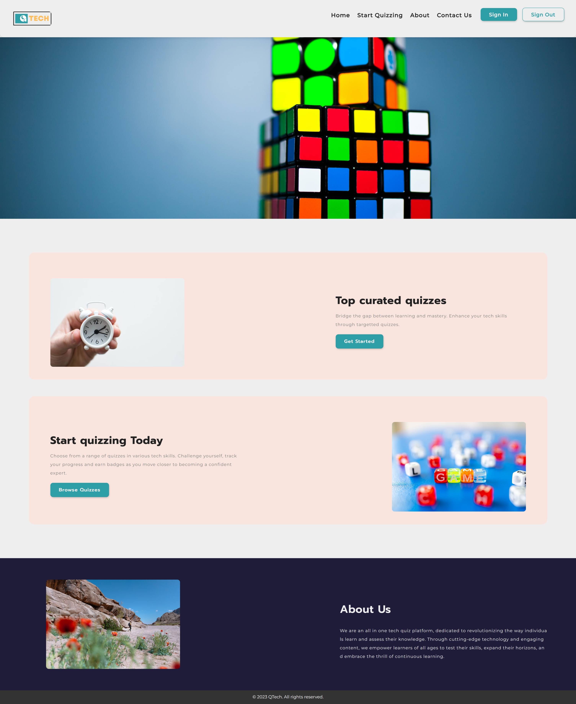

# team2 : QTech - A Bridge to Mastery

## Table of Contents

- [Introduction](#introduction)
- [Team Thought Process](#team-thought-process)
- [Project Name: QTech](#project-name-qtech)
- [Design](#design)
- [Challenges](#challenges)
- [The Name "QTech"](#the-name-qtech)
- [Tools and Resources](#tools-and-resources)
- [Conclusion](#conclusion)

## Introduction

Welcome 👋 to the README file for QTech - A Bridge to Mastery! This document will provide you with insights into our team's thought process, the inception of our project, design decisions, the challenges we faced, and the tools and resources we used throughout our journey.

## Team Thought Process

Our project began with a collaborative brainstorming session. We believed that the collective power of our ideas would lead to something extraordinary. To foster creativity and individual contributions, we initially embarked on a take-home assignment where each team member was encouraged to delve into their thoughts, jot down ideas, and brainstorm together.

## Project Name: QTech

Amid our brainstorming sessions, we stumbled upon an exciting concept - a quiz app. We named it **QTech - A Bridge to Mastery** to reflect its purpose of helping users bridge the gap to mastery through engaging quizzes.

## Design

Our project's design process began with a skeleton design, which we drafted using the online tool "apps.diagram.net". While this tool facilitated our design discussions, we encountered challenges with some team members unable to access the link. Nevertheless, our team remained persistent and continued pushing forward, valuing collaboration and problem-solving.

## Challenges

One of the significant challenges we faced was the absence of a dedicated designer on our team. This gap affected our design process, but we tackled it with creativity and adaptability.

## The Name "QTech"

The name "QTech" evolved from a pool of different suggestions contributed by team members. Initially, we had "Exoo," but with a slight tweak, we arrived at "QTech." We chose this name because it encapsulated our vision of technology-driven learning and advancement. Thus, "QTech - A Bridge to Mastery" was born.

## Tools and Resources

Our team utilized the following tools and resources to collaborate effectively:

- **HTML, CSS, and JavaScript**: These languages formed the foundation of our app's development, allowing us to create an interactive and user-friendly experience.

- **Discord**: We used Discord for real-time communication and collaboration, enabling us to stay connected and informed throughout the project.

- **Trello**: Trello served as our project management tool, helping us organize tasks, set priorities, and track progress. You can access our Trello board [here](https://trello.com/b/CoHM2Vkw/group-two).

- **apps.diagram.net**: Despite some initial challenges, apps.diagram.net played a crucial role in visualizing and refining our project's design. You can view our diagrams [here](https://app.diagrams.net/#G1Ao8xP-mqmF8DHF0lqHYSjEClKP8CnHB1#%7B%22pageId%22%3A%229lMivOABrpIKYraErN3g%22%7D).

## Conclusion

QTech - A Bridge to Mastery is the result of our team's dedication, creativity, and collaborative spirit. We hope this README file provides you with valuable insights into our project's journey. Thank you for taking the time to learn about QTech, and we look forward to your engagement with our quiz app and collaboration!

We also accept feedback and criticism. Check out the project live link [here](https://team2-theta.vercel.app/).
